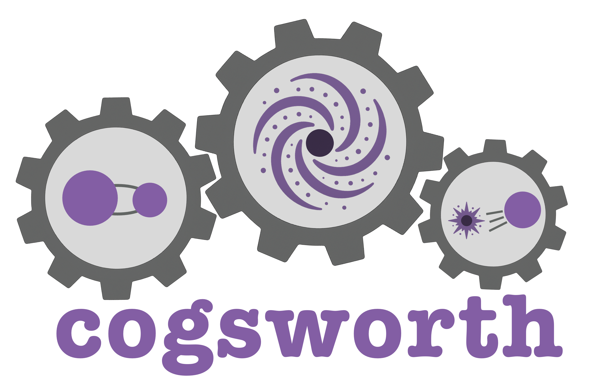

<h1 align='center'>
    <picture>
    <source media="(prefers-color-scheme: dark)" srcset="docs/_static/cogsworth-logo-darkmode.png">
    <source media="(prefers-color-scheme: light)" srcset="docs/_static/cogsworth-logo.png">
    
    </picture>
     
  

  
  
  
  
</h1>
<h4 align="center">cogsworth is a Python package for performing seamlessly self-consistent population synthesis and galactic dynamics simulations!</h4>

### Installation

A quick and easy `pip install cogsworth` will cover most use cases, but we recommend using a conda environment as well. Check out the full instructions [here](https://cogsworth.readthedocs.io/en/latest/pages/install.html).

### Documentation
You can learn all about cogsworth from our collection of tutorials, examples and in-depth case studies on our online documentation [here](https://cogsworth.readthedocs.io/en/latest/index.html).
